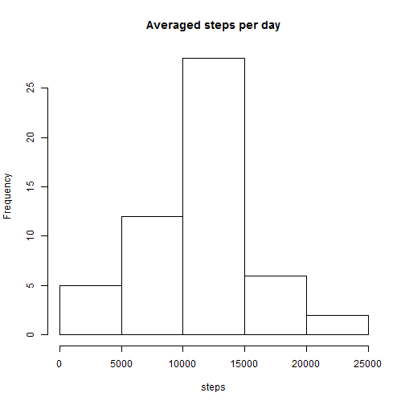
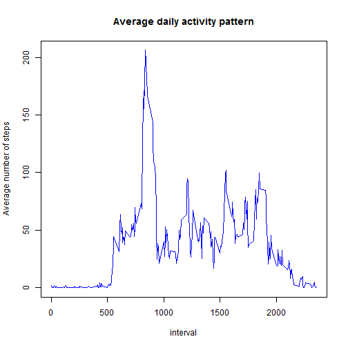
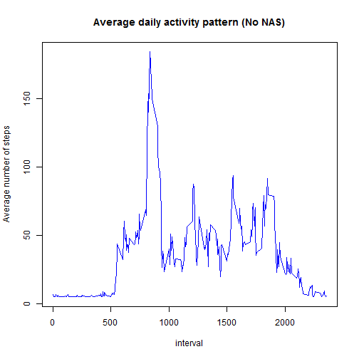

## Importing libraries and Seting seed

```r
library(dplyr)
library(lattice)
set.seed(42)
```

## Loading and preprocessing the data


```r
data <- read.csv("activity.csv", header = TRUE, sep = ",")
```

  *Setting the date to date format*
```r
data$date <- as.Date(data$date, "%Y-%m-%d")
```

## What is mean total number of steps taken per day?
  *Creating a histogram for total number of Steps taken per day*
  
     *Aggregating the data to find sum of steps per day
     *Plotting the Total steps per day

```r
by_date <- group_by(data, date)
steps_per_day<-summarize(by_date, sum(steps))
names(steps_per_day)<-c('date', 'steps')
hist(steps_per_day$steps, xlab="steps", main="Averaged steps per day")
```
 


  *Computing the mean of steps per day*
  

```r
mean(steps_per_day$steps, na.rm=TRUE)
```

```
## [1] 10766.19
```

  *Computing the median of steps per day*


```r
median(steps_per_day$steps, na.rm=TRUE)
```

```
## [1] 10766
```

## What is the average daily activity pattern?

  *Creating the time series plot at 5 mins interval*
    
    *Aggregating the data to calculate the mean steps at 5 min interval
    *Plotting the average steps per interval
    

```r
by_interval = group_by(data, interval)
spi = summarize(by_interval, mean(steps, na.rm=TRUE))
names(spi)<-c('interval', 'steps')
plot(steps ~ interval, data = spi, type = "l", xlab = "interval", 
     ylab = "Average number of steps", main = "Average daily activity pattern", 
     col = "blue")
```
 

  *Displaying the 5 min interval with maximum average number of steps*

```r
spi[which.max(spi$steps), ]
```

```
## [1] 835 206.1698
```

## Imputing missing values

    
```r
nas <- is.na(data$steps)
num_nas <- sum(nas)
```

*Displaying the number of missing values*


```
## [1] 2304
```

*Replacing Missing values with the interval mean averaged over all the days*
  
```r
data_no_nas <- data
data_no_nas[nas, 'steps'] <- mean_interval
```
*New Histogram of the total number of steps taken each day with no NAs*

```r
by_interval_no_nas = group_by(data_no_nas, interval)
spi_no_nas = summarize(by_interval_no_nas, mean(steps, na.rm=TRUE))
names(spi_no_nas)<-c('interval', 'steps')
plot(steps ~ interval, data = spi_no_nas, type = "l", xlab = "interval", 
    ylab = "Average number of steps", main = "Average daily activity pattern (No NAS)",
    col = "blue")
```

 


## Are there differences in activity patterns between weekdays and weekends?

```r
data_no_nas$wdt <- as.factor(ifelse(weekdays(data_no_nas$date) 
    %in% c("sábado", "domingo"), "weekend", "weekday"))
data_no_nas_weekware <- aggregate(data_no_nas$steps, data_no_nas[c(3,4)], mean)
xyplot(x ~ interval | wdt, data = data_no_nas_weekware, layout = c(1, 2), 
    type = "l", xlab = "Interval",  ylab = "Number of steps")
```
 
